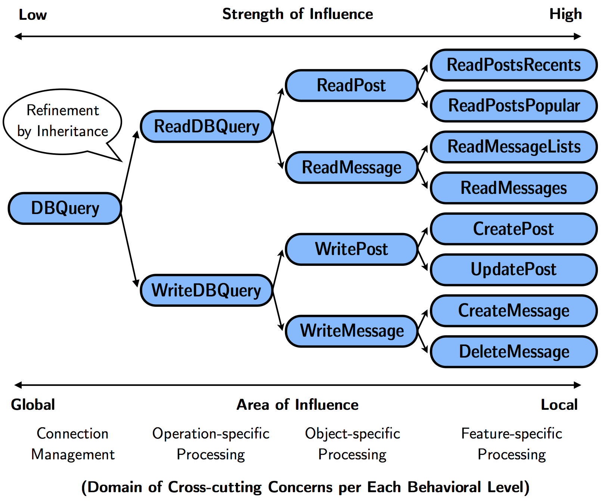
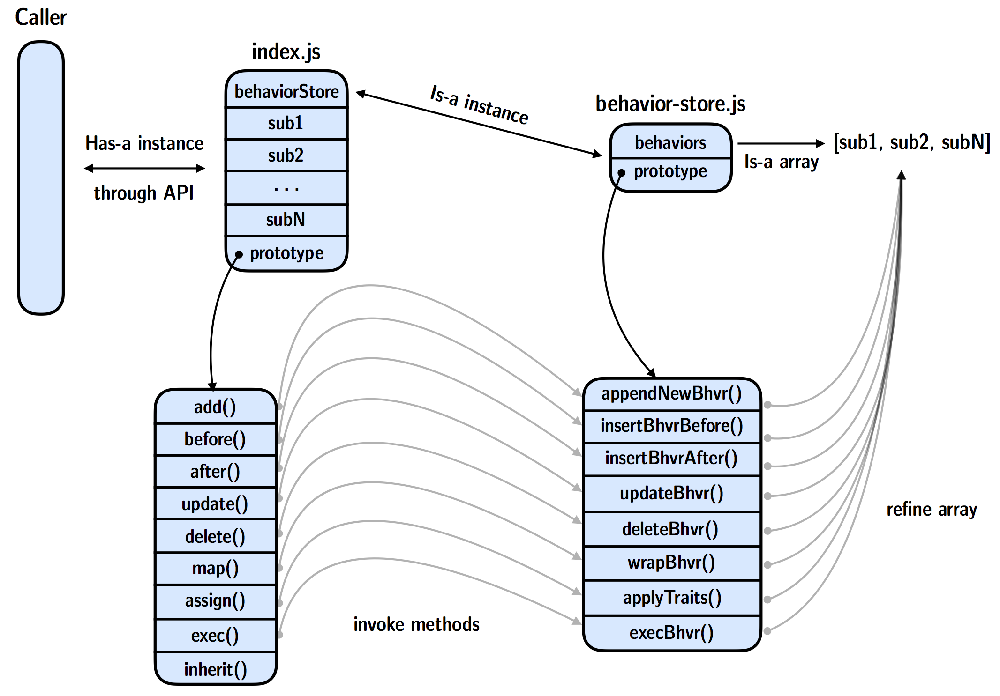

[](https://travis-ci.org/hiun/self-js)

# Self
Bringing Object-oriented Modularity to Function. JavaScript Implementation of [Self-composable Programming](https://arxiv.org/abs/1612.02547). 

##Self-composable Programming
Self-composable Programming(Self) is a technique for Software Product Line Engineering to manage variability on software feature implementation. Self bring an object-oriented approach to increasing modularity by localising scattered and so tangled behavior - the ***commonalities*** to ***abstract function*** and ***variabilities*** to inherited ***specific function*** by applying refinement. Programming-level compositional approach on software modularity include metaprogramming or aspect-oriented programming works well while Self provides different advantages, Self is nothing new, does not requires special compiler or language feature but fully used the vision and idea provided since SIMULA67, which is *modeling the real world*. I am sure Object-oriented Programming is good at modeling ***things*** but not ***behaviors***, while the concept, Object-orientation could suitable for this and Self provides a practical approach to modeling of modern software behavior by bringing ***hierarchical relationship*** as you seen below in the example of a web application.



## Installation
```
npm install self
```

## API
| **Method Name** | **Description** |
| ------------- |:-------------:|
|**Bahevior#add(Function\|Bahevior)** | Append given function or behavior into high-level behacior|
|**Behavior#Sub#before(Function\|Bahevior)** | Insert given function or behavior before specified behavior|
|**Behavior#Sub#after(Function\|Bahevior)** | Insert given function or behavior after specified behavior|
|**Behavior#Sub#update(Function\|Bahevior)** | Update specified behavior into given function or behavior|
|**Behavior#Sub#delete(Function\|Bahevior)** | Delete specified behavior|
|**Behavior#Sub#map(Function\|Bahevior)** | Manipulate specified behavior with new function or behavior that takes original behavior as an argument|
|**Behavior#assign(Function\|Bahevior)<br>Behavior#sub#assign(Function\|Bahevior)** | Assigns traits to specific behavior with given traits object|
|**Behavior#DefineProperty(Name, Function\|Bahevior)** | define new method for refinement|

## Examples

###Behavior Construction
```javascript
var Behavior = require('self');

var DBQuery = new Behavior();

DBQuery.add(auth);
DBQuery.add(validate);
DBQuery.add(monit);
```

###Bahevior Inheritance
```javascript
/* Operation-specific Processing */
var ReadDBQuery = new DBQuery();
var WriteDBQuery = new DBQuery();

/* Object-specific Processing */
var ReadPost = new ReadDBQuery();
var WritePosts = new WriteDBQuery();

/* Feature-specific Processing */
var ReadPostsRecents = new ReadPosts();
var ReadPostsPopular = new ReadPosts();
var CreatePost = new WritePost();
var UpdatePost = new WritePost();
```


###Explicit Behavior Refinement
```javascript
var WriteDBQuery = new DBQuery();

WriteDBQuery.add(writeBack);
WriteDBQuery.monitoring.update(cacheMonit);
WriteDBQuery.validate.before(beforeValidate);
WriteDBQuery.validate.after(afterValidate);
WriteDBQuery.validate.map(() => {
    return (validate) => {
      validateWrapper(validate);
}
});
WriteDBQuery.beforeValidate.delete();

var CreatePost = new WriteDBQuery();

CreatePost.add(createUserSQLExec);
CreatePost.auth.update(2factorAuth);
```


###Implicit Behavior Refinement
Traits is object-independent, set of composable behavior. By `assign` method, behavior could refiend in high-level and implicit manner. 

```javascript
var publicApiTraits = {
    auth: null
};

WriteDBQuery.assign(publicApiTraits);
```

###Custom Behavior Refinement
By using `defineMethod`, user can create custom refinement method by accessing behavior array in the function. The following example is removing sub-behavior which start with `add` by doing simple pattern matching. In the definition, usage of standard API is possible by `apply` method with custom scope.

```javascript
Formula.defineMethod('deleteAddition', function () {
  var self = this;
  this.behaviorStore.forEach(function (behacior) {
    if (behavior.name.slice(0, 4) === 'add') {
      this.delete.apply({name: behavior.name})
    }
  });
});
```

##Internals

###Architecture

`Self-js` has two major part `index.js` for provides user-visible API and `behavior-store.js` for internal operating mechanism. When `index.js` is loaded as a behavior constructor in program then user interact with standard API in prototype of `behavior instance`, the `sub1`, `sub2` in `behavior instance` does not store actual `behavior instance` but it stores only name and designated to provides an anchor for invoeke internal operating mechanism.

###Operating Mechanism
The goal of operatation in `Self-js`, as a both conceptual and implementation perspective, is fullfull variability of software feature applying easy and sophisticated refinement to element - a sub behavior in array. To do this, every `behavior instance` has its own `behavior-store instance` which stores actual behaviors array and its method to perform manipulation. As a result, the caller user program indirectly manipulates behavior.

##Todos
- Support for asynchronous task with serial invocation of Promise
- Same operation in single behavior how to manage?
- Can behavior in more than 1 depth is worked normally?

##Development Status
Status : Currently experimental and unstable.